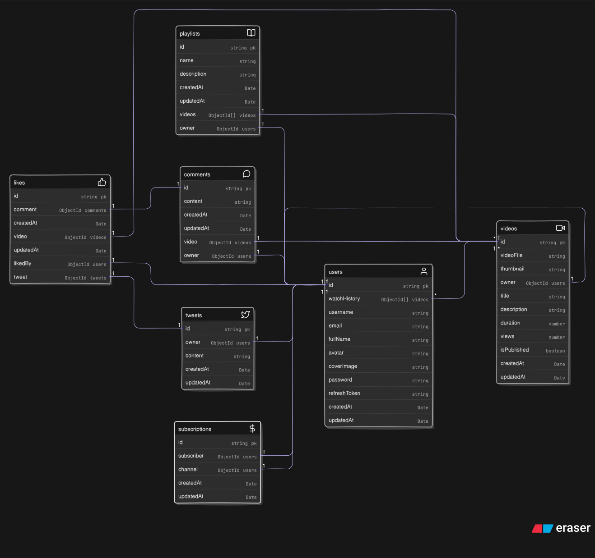

# 🌪️ VortexStream

A dynamic media platform where content (videos, likes, comments, subscriptions) continuously flows, engaging users in a rich ecosystem of media.

## Badges

[](https://developer.mozilla.org/en-US/docs/Web/JavaScript)
[](https://nodejs.org/)
[](https://expressjs.com/)
[](https://www.mongodb.com/)
[](https://mongoosejs.com/)
[](https://jwt.io/)
[](https://www.npmjs.com/package/bcryptjs)
[](https://www.npmjs.com/package/dotenv)
[](https://nodemon.io/)
[](https://cloudinary.com/)
[](https://developer.mozilla.org/en-US/docs/Glossary/REST)
[](https://www.npmjs.com/package/cors)
[](https://www.npmjs.com/package/cookie-parser)
[](https://www.npmjs.com/package/mongoose-aggregate-paginate-v2)
[](https://www.npmjs.com/package/multer)
[](https://www.mongodb.com/mern-stack)

## 🔧 Tech Stack

- **Backend:** Node.js, Express.js
- **Database:** MongoDB with Mongoose
- **Authentication:** JWT, bcryptjs
- **Media Storage:** Cloudinary
- **Cookies:** Cookie Parser
- **Environment Management:** dotenv
- **Security Management:** CORS
- **Utilities:** express-async-handler, multer, nodemon

## 🚀 Features

- User authentication and management using JWT & bcryptjs
- Video upload, streaming, and management
- Commenting system on videos
- Likes and subscriptions for user engagement
- Tweet-like microblogging feature
- Playlists for organizing videos
- Dashboard for analytics and insights
- RESTful API endpoints for all resources
- Error handling with Express middlewares
- Environment-based configuration support
- Scalable folder structure

## 📂 Folder Structure

VortexStream/  
├── public/ # Static files and assets  
├── src/ # Source files (app.js, index.js, etc.)  
├───── utils/ # Utility functions  
├───── config/ # Database and other configurations  
├───── routes/ # API route definitions  
├───── models/ # Mongoose schemas for User, Video, Comment, etc.  
├───── controllers/ # Route logic for users, videos, comments, etc.  
├───── middlewares/ # Custom middleware for auth, file upload, etc.  
├── .env # Environment variables (not committed)  
├── constants.js # Status codes and reusable constants  
├── package.json # Project metadata and dependencies

## 🗺️ Database Schema

Visual representation of the core models and their relationships:



## 🛠️ Setup Instructions

### 1. Clone the repository

```js
git clone https://github.com/KalraH/VortexStream.git
cd VortexStream
```

---

### 2. Install dependencies

```js
npm install
```

---

### 3. Create a `.env` file in the root directory and add the following variables:

```js
# Environment Configuration
PORT = 3001

# Database Configuration
CORS_ORIGIN = http://localhost:3001
MONGO_DB_URI = your_mongodb_connection_string

## JWT Configuration
CLOUDINARY_API_KEY = your_cloudinary_api_key
CLOUDINARY_CLOUD_NAME = your_cloudinary_cloud_name
CLOUDINARY_API_SECRET = your_cloudinary_api_secret

# Cloudinary Configuration
ACCESS_TOKEN_SECRET = your_accessToken_Sectet
REFRESH_TOKEN_SECRET = your_refreshToken_Sectet
REFRESH_TOKEN_EXPIRATION = your_refreshToken_expiration_time
ACCESS_TOKEN_EXPIRATION = your_accessToken_expiration_time
```

---

### 4. Run the project

#### Development mode

```bash
npm run dev
```

#### Production mode

```bash
npm start
```

## Environment Variables

To run this project, you will need to add the following environment variables to your .env file

`PORT` 3000

`CORS_ORIGIN` your ORIGIN for avoiding CORS Errors

`MONGO_DB_URI` your mongodb connection string

`CLOUDINARY_API_KEY` your Cloudinary API key

`CLOUDINARY_CLOUD_NAME` your Cloudinary Cloud Name

`CLOUDINARY_API_SECRET` your Cloudinary API secret key

`ACCESS_TOKEN_SECRET` your Access Token JWT secret key

`REFRESH_TOKEN_SECRET` your Refresh Token JWT secret key

`REFRESH_TOKEN_EXPIRATION` your Refresh Token expiration duration

`ACCESS_TOKEN_EXPIRATION` your Refresh Token expiration duration

## 📡 API References

### 1. **User Routes:** User Registration, Authentication & Management

| Endpoint                                    |                                Method                                 | Public/Private | Description                              |
| ------------------------------------------- | :-------------------------------------------------------------------: | :------------: | ---------------------------------------- |
| `/api/1/users/current`                      |      |    Private     | Get currently Logged-in user details     |
| `/api/1/users/watch-history`                |      |    Private     | Retrieve video watch history of the user |
| `/api/1/users/userChannelProfile/:userName` |      |    Private     | Get user's channel profile by username   |
| `/api/1/users/register`                     |    |     Public     | Register a new user                      |
| `/api/1/users/login`                        |    |     Public     | Authenticate and Log-in an existing user |
| `/api/1/users/logout`                       |    |    Private     | Log-out the currently Logged-in user     |
| `/api/1/users/refresh-token`                |    |    Private     | Generate a refresh token for a user      |
| `/api/1/users/u/reset-pass`                 |  |    Private     | Reset user password                      |
| `/api/1/users/u/data`                       |  |    Private     | Update user's Profile Data               |
| `/api/1/users/u/avatar`                     |  |    Private     | Update user's Avatar Image               |
| `/api/1/users/u/cover-image`                |  |    Private     | Update user's Cover Image                |

---

### 2. **Tweet Routes:** Tweet-like Mocroblogging features

| Endpoint                    |                                 Method                                  | Public/Private | Description               |
| --------------------------- | :---------------------------------------------------------------------: | :------------: | ------------------------- |
| `/api/1/tweet/user/:userId` |        |    Private     | Get all tweets for a user |
| `/api/1/tweet`              |      |    Private     | Create a new tweet        |
| `/api/1/tweet/:tweetId`     |    |    Private     | Update a tweet            |
| `/api/1/tweet/:tweetId`     |  |    Private     | Delete a tweet            |

---

### 3. **Subscription Routes:** Manage user subscriptions

| Endpoint                               |                               Method                                | Public/Private | Description                                               |
| -------------------------------------- | :-----------------------------------------------------------------: | :------------: | --------------------------------------------------------- |
| `/api/1/subscriptions/u/:subscriberId` |    |    Private     | Get all subscribers of a specific user/channel            |
| `/api/1/subscriptions/c/:channelId`    |    |    Private     | Get all channels the user is subscribed to                |
| `/api/1/subscriptions/c/:channelId`    |  |    Private     | Toggle (subscribe/unsubscribe) the user to/from a channel |

---

### 4. **Video Routes:** Upload and Manage User & Playlist Videos

| Endpoint                               |                                 Method                                  | Public/Private | Description                                     |
| -------------------------------------- | :---------------------------------------------------------------------: | :------------: | ----------------------------------------------- |
| `/api/1/video`                         |        |    Private     | Get all videos as per Query, Search             |
| `/api/1/video/:videoId`                |        |    Private     | Get a video by its ID                           |
| `/api/1/video`                         |      |    Private     | Upload a new video with file and thumbnail      |
| `/api/1/video/:videoId`                |    |    Private     | Update a video's info or thumbnail              |
| `/api/1/video/toggle/publish/:videoId` |    |    Private     | Toggle video publish status (publish/unpublish) |
| `/api/1/video/:videoId`                |  |    Private     | Delete a video by its ID                        |

---

### 5. **Comment Routes:** Post and Manage Comments Videos

| Endpoint                       |                                 Method                                  | Public/Private | Description                |
| ------------------------------ | :---------------------------------------------------------------------: | :------------: | -------------------------- |
| `/api/1/comments/:videoId`     |        |    Private     | Get comments for a video   |
| `/api/1/comments/:videoId`     |      |    Private     | Add a comment to a video   |
| `/api/1/comments/c/:commentId` |    |    Private     | Update a comment by its ID |
| `/api/1/comments/c/:commentId` |  |    Private     | Delete a comment by its ID |

---

### 6. **Like Routes:** Like/Unlike Videos, Tweets or Comments of users

| Endpoint                           |                               Method                                | Public/Private | Description                  |
| ---------------------------------- | :-----------------------------------------------------------------: | :------------: | ---------------------------- |
| `/api/1/likes/videos`              |    |    Private     | Get videos liked by the user |
| `/api/1/likes/toggle/v/:videoId`   |  |    Private     | Toggle like on a video       |
| `/api/1/likes/toggle/t/:tweetId`   |  |    Private     | Toggle like on a tweet       |
| `/api/1/likes/toggle/c/:commentId` |  |    Private     | Toggle like on a comment     |

---

### 7. **Playlist Routes:** Create and Manage User Playlist and its Videos

| Endpoint                                      |                                 Method                                  | Public/Private | Description                    |
| --------------------------------------------- | :---------------------------------------------------------------------: | :------------: | ------------------------------ |
| `/api/1/playlist/user/:userId`                |        |    Private     | Get all playlists for a user   |
| `/api/1/playlist/:playlistId`                 |        |    Private     | Get a playlist by its ID       |
| `/api/1/playlist`                             |      |    Private     | Create a new playlist          |
| `/api/1/playlist/add/:videoId/:playlistId`    |    |    Private     | Add a video to a playlist      |
| `/api/1/playlist/remove/:videoId/:playlistId` |    |    Private     | Remove a video from a playlist |
| `/api/1/playlist/:playlistId`                 |    |    Private     | Update playlist details        |
| `/api/1/playlist/:playlistId`                 |  |    Private     | Delete a playlist              |

---

### 8. **Dashboard Routes:** User analytics and dashboard data

| Endpoint                  |                              Method                               | Public/Private | Description                         |
| ------------------------- | :---------------------------------------------------------------: | :------------: | ----------------------------------- |
| `/api/1/dashboard/stats`  |  |    Private     | Get stats for the creator's channel |
| `/api/1/dashboard/videos` |  |    Private     | Get all videos for the channel      |

> 📌 **Legend**
>
> **Public**: Accessible without authentication  
> **Private**: Requires authentication (`Authorization: Bearer <token>` or secure cookies)

---

<div align="center">
**If you like this project, leave a ⭐ and follow for updates!**

_Made with ❤️ by [Hariom Kalra](https://github.com/KalraH)_

</div>
